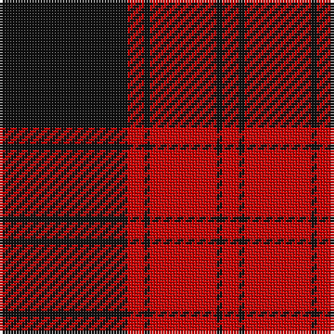

The parent of this is [Ewing Clan Tartan Tartan Number: 11082. Earliest known date: 2014 Following official recognition, this tartan was chosen by the new Commander of Clan Ewing, John Thor Ewing, as the Clan Ewing tartan. The tartan takes its inspiration from the plaid of John Ewing in Heiddykis of Kirkmichael (d.1609), described in his testament as 'sax ellis of reid & blak cullerit claith' The design relates to historical and traditional tartans from the areas and clans among which Clan Ewing has its roots. This tartan is woven to order by Lochcarron on behalf of Clan Ewing. All weavers must seek permission from John Thor Ewing as registrant and copyright holder. See products available Copyright © Blair Urquhart, Comrie, 2015](/tartans/k/46/r6/k2/r24/k2/r/6/)

This was sourced from house-of-tartan.  It is a [6 stripes tartan](/stripes/stripes6/).

Original link http://www.house-of-tartan.scotland.net/house/TartanViewjs.asp?colr=Def&tnam=11082

## Thread count
K/46 R6 K2 R24 K2 R/6

## Palette
Each colour and its ΔE from the base-6 reference it is a variant of.

| Colour | Shade | Base | ΔE (OKLab) |
|---|---|---|---|
| K |  `#101010` | K  | 0.17 |
| R |  `#C80000` | R  | 0.00 |

# Sample pattern

ID: /variants/k/46/r6/k2/r24/k2/r/6-k101010-rc80000/
