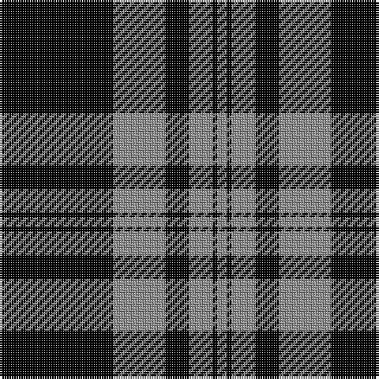

The parent of this is [Black Isle Corporate Tartan Tartan Number: 6183. Earliest known date: 15/07/2003 Designed for Black Isle Pewter Limited by Robert Howarth Guibal of Black Isle Pewter. Threadcount taken from a Marton Mills swatch book. See products available Copyright © Blair Urquhart, Comrie, 2015](/tartans/k/48/n22/k10/n10/k2/n/4/)

This was sourced from house-of-tartan.  It is a [6 stripes tartan](/stripes/stripes6/).

Original link http://www.house-of-tartan.scotland.net/house/TartanViewjs.asp?colr=Def&tnam=6183

## Thread count
K/48 N22 K10 N10 K2 N/4

## Palette
Each colour and its ΔE from the base-6 reference it is a variant of.

| Colour | Shade | Base | ΔE (OKLab) |
|---|---|---|---|
| K |  `#000000` | K  | 0.00 |
| N |  `#8E8E8E` | Y  | 0.24 |

# Sample pattern

ID: /variants/k/48/n22/k10/n10/k2/n/4-k000000-n8e8e8e/
