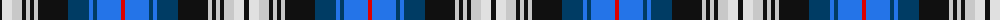

The parent of this is [Anderson-Moffat (Personal)](/tartans/k/5/ln10/n10/k4/n4/k4/n4/k30/db21/b4/db4/b24/r/4/)

This was sourced from register-of-tartans.  It is a [13 stripes tartan](/stripes/stripes13/).

Original link https://www.tartanregister.gov.uk/tartanDetails.aspx?ref=11504

## Thread count
K/5 LN10 N10 K4 N4 K4 N4 K30 DB21 B4 DB4 B24 R/4

## Palette
Each colour and its ΔE from the base-6 reference it is a variant of.

| Colour | Shade | Base | ΔE (OKLab) |
|---|---|---|---|
| B |  `#2474E8` | B  | 0.20 |
| DB |  `#003C64` | B  | 0.07 |
| K |  `#101010` | K  | 0.17 |
| LN |  `#E0E0E0` | W  | 0.06 |
| N |  `#C8C8C8` | W  | 0.13 |
| R |  `#DC0000` | R  | 0.04 |

ID: /variants/k/5/ln10/n10/k4/n4/k4/n4/k30/db21/b4/db4/b24/r/4-b2474e8-db003c64-k101010-lne0e0e0-nc8c8c8-rdc0000/
