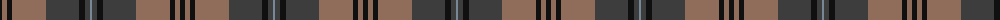
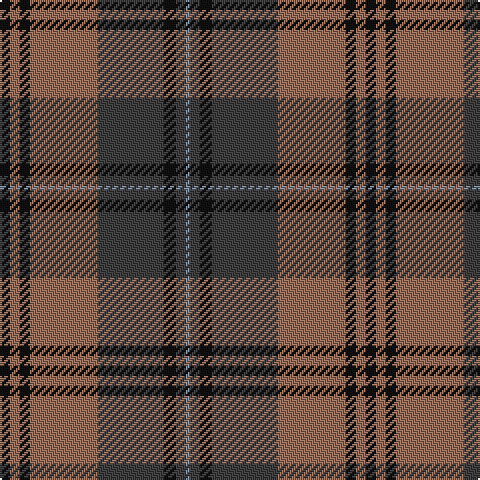

The parent of this is [Brave for Men Fashion Tartan Tartan Number: 10666. Earliest known date: 28/06/2012 A woven sample of this tartan has been received by the Scottish Register of Tartans for permanent preservation in the National Records of Scotland. See products available Copyright © Blair Urquhart, Comrie, 2015](/tartans/k/5/lt5/k5/lt34/na33/k6/na5/n/2/)

This was sourced from house-of-tartan.  It is a [8 stripes tartan](/stripes/stripes8/).

Original link http://www.house-of-tartan.scotland.net/house/TartanViewjs.asp?colr=Def&tnam=10666

## Thread count
K/5 LT5 K5 LT34 Na33 K6 Na5 N/2

## Palette
Each colour and its ΔE from the base-6 reference it is a variant of.

| Colour | Shade | Base | ΔE (OKLab) |
|---|---|---|---|
| K |  `#101010` | K  | 0.17 |
| LT |  `#906C5A` | R  | 0.17 |
| N |  `#778899` | B  | 0.24 |
| Na |  `#3D3D3D` | B  | 0.12 |

# Sample pattern

ID: /variants/k/5/lt5/k5/lt34/na33/k6/na5/n/2-k101010-lt906c5a-n778899-na3d3d3d/
