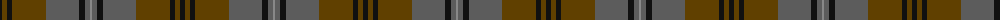

The parent of this is [Brave for Men (Fashion)](/tartans/k/5/t5/k5/t34/n33/k6/n5/na/2/)

This was sourced from tartans-authority.  It is a [8 stripes tartan](/stripes/stripes8/).

Original link http://www.tartansauthority.com/tartan-ferret/display/10667/

## Thread count
K/5 T5 K5 T34 N33 K6 N5 Na/2

## Palette
Each colour and its ΔE from the base-6 reference it is a variant of.

| Colour | Shade | Base | ΔE (OKLab) |
|---|---|---|---|
| K |  `#101010` | K  | 0.17 |
| N |  `#5C5C5C` | B  | 0.14 |
| Na |  `#888888` | R  | 0.24 |
| T |  `#604000` | G  | 0.14 |

# Sample pattern

ID: /variants/k/5/t5/k5/t34/n33/k6/n5/na/2-k101010-n5c5c5c-na888888-t604000/
