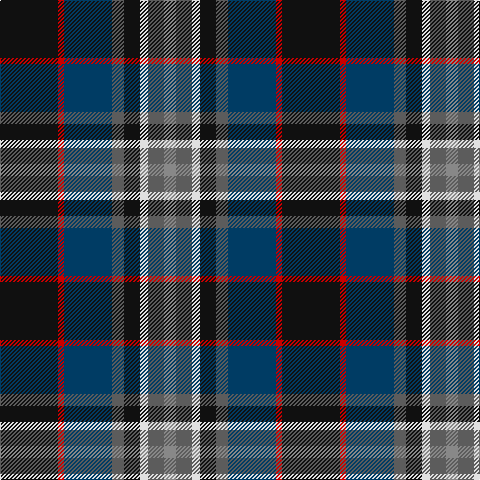

The parent of this is [Yates (Personal)](/tartans/k/58/r6/db48/n12/k16/ln8/n16/na/12/)

This was sourced from tartans-authority.  It is a [8 stripes tartan](/stripes/stripes8/).

Original link http://www.tartansauthority.com/tartan-ferret/display/7091/

## Thread count
K/58 R6 DB48 N12 K16 LN8 N16 Na/12

## Palette
Each colour and its ΔE from the base-6 reference it is a variant of.

| Colour | Shade | Base | ΔE (OKLab) |
|---|---|---|---|
| DB |  `#003C64` | B  | 0.07 |
| K |  `#101010` | K  | 0.17 |
| LN |  `#E0E0E0` | W  | 0.06 |
| N |  `#5C5C5C` | B  | 0.14 |
| Na |  `#888888` | R  | 0.24 |
| R |  `#C80000` | R  | 0.00 |

# Sample pattern

ID: /variants/k/58/r6/db48/n12/k16/ln8/n16/na/12-db003c64-k101010-lne0e0e0-n5c5c5c-na888888-rc80000/
