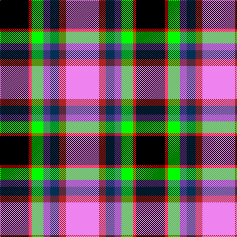

The parent of this is [Hatcher (Texas) (Personal)](/tartans/k/58/r6/g24/b14/db18/ra14/lp/66/)

This was sourced from register-of-tartans.  It is a [7 stripes tartan](/stripes/stripes7/).

Original link https://www.tartanregister.gov.uk/tartanDetails.aspx?ref=10121

## Thread count
K/58 R6 G24 B14 DB18 Ra14 LP/66

## Palette
Each colour and its ΔE from the base-6 reference it is a variant of.

| Colour | Shade | Base | ΔE (OKLab) |
|---|---|---|---|
| B |  `#6B3FA0` | B  | 0.11 |
| DB |  `#003053` | B  | 0.11 |
| G |  `#00FF00` | Y  | 0.23 |
| K |  `#000000` | K  | 0.00 |
| LP |  `#EE82EE` | W  | 0.28 |
| R |  `#FF0000` | R  | 0.11 |
| Ra |  `#B22222` | R  | 0.04 |

# Sample pattern

ID: /variants/k/58/r6/g24/b14/db18/ra14/lp/66-b6b3fa0-db003053-g00ff00-k000000-lpee82ee-rff0000-rab22222/
