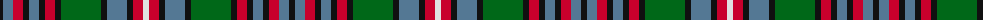

The parent of this is [Schneidersohne Centenary (Corporate)](/tartans/k/6/b10/r10/k6/b10/k6/r10/k6/g40/k6/b20/k6/r10/ln/6/)

This was sourced from tartans-authority.  It is a [14 stripes tartan](/stripes/stripes14/).

Original link http://www.tartansauthority.com/tartan-ferret/display/4533/

## Thread count
K/6 B10 R10 K6 B10 K6 R10 K6 G40 K6 B20 K6 R10 LN/6

## Palette
Each colour and its ΔE from the base-6 reference it is a variant of.

| Colour | Shade | Base | ΔE (OKLab) |
|---|---|---|---|
| B |  `#547894` | B  | 0.18 |
| G |  `#006818` | G  | 0.02 |
| K |  `#101010` | K  | 0.17 |
| LN |  `#E0E0E0` | W  | 0.06 |
| R |  `#C8002C` | R  | 0.03 |

ID: /variants/k/6/b10/r10/k6/b10/k6/r10/k6/g40/k6/b20/k6/r10/ln/6-b547894-g006818-k101010-lne0e0e0-rc8002c/
