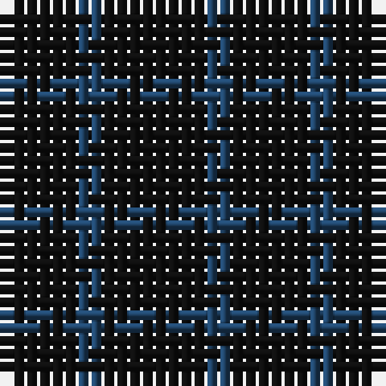

The parent of this is [Ben Dubh (Fashion)](/tartans/k/6/b2/k/8/)

This was sourced from tartans-authority.  It is a [3 stripes tartan](/stripes/stripes3/).

Original link http://www.tartansauthority.com/tartan-ferret/display/6681/

## Thread count
K/6 B2 K/8

## Palette
Each colour and its ΔE from the base-6 reference it is a variant of.

| Colour | Shade | Base | ΔE (OKLab) |
|---|---|---|---|
| B |  `#204468` | B  | 0.05 |
| K |  `#101010` | K  | 0.17 |

# Sample pattern

ID: /variants/k/6/b2/k/8-b204468-k101010/
