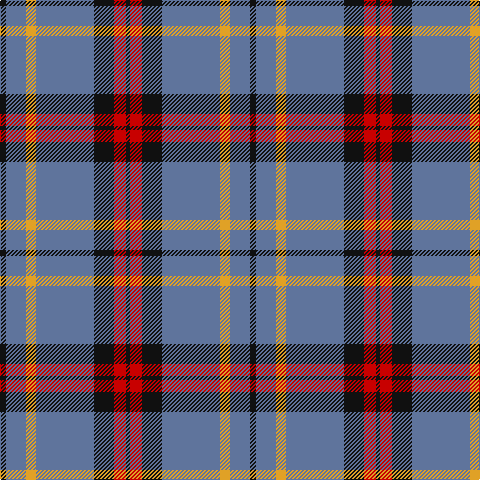

The parent of this is [Perkins (2015)](/tartans/k/6/b20/y10/b58/k20/r12/k/4/)

This was sourced from register-of-tartans.  It is a [7 stripes tartan](/stripes/stripes7/).

Original link https://www.tartanregister.gov.uk/tartanDetails.aspx?ref=11211

## Thread count
K/6 B20 Y10 B58 K20 R12 K/4

## Palette
Each colour and its ΔE from the base-6 reference it is a variant of.

| Colour | Shade | Base | ΔE (OKLab) |
|---|---|---|---|
| B |  `#5F749C` | B  | 0.17 |
| K |  `#101010` | K  | 0.17 |
| R |  `#C80000` | R  | 0.00 |
| Y |  `#E0A126` | Y  | 0.08 |

# Sample pattern

ID: /variants/k/6/b20/y10/b58/k20/r12/k/4-b5f749c-k101010-rc80000-ye0a126/
