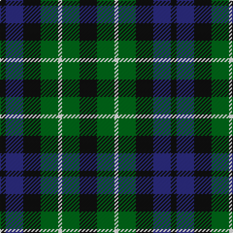

The parent of this is [Graham of Montrose - 1850 (Clan)](/tartans/k/6/db18/k18/g18/w4/g18/k/18/)

This was sourced from tartans-authority.  It is a [7 stripes tartan](/stripes/stripes7/).

Original link http://www.tartansauthority.com/tartan-ferret/display/1044/

## Thread count
K/6 DB18 K18 G18 W4 G18 K/18

## Palette
Each colour and its ΔE from the base-6 reference it is a variant of.

| Colour | Shade | Base | ΔE (OKLab) |
|---|---|---|---|
| DB |  `#2C2C80` | B  | 0.05 |
| G |  `#006818` | G  | 0.02 |
| K |  `#101010` | K  | 0.17 |
| W |  `#FCFCFC` | W  | 0.03 |

# Sample pattern

ID: /variants/k/6/db18/k18/g18/w4/g18/k/18-db2c2c80-g006818-k101010-wfcfcfc/
