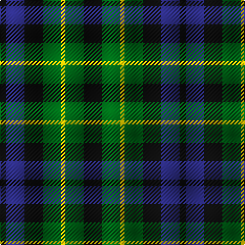

The parent of this is [Campbell of Breadalbane Clan Tartan Tartan Number: 1046. Earliest known date: 1810-15 The earliest reference to this pattern is called simply, Breadalbane. W. and A. Smith (1850) were the first to illustrate the sett in its present form. Wilson's of Bannockburn produced this pattern, the No. 64 or 'Abercrombie' in a variety of colours. (See Graham, MacCallum, Rollo.) See products available Copyright © Blair Urquhart, Comrie, 2015](/tartans/k/6/db18/k18/g18/y4/g18/k/18/)

This was sourced from house-of-tartan.  It is a [7 stripes tartan](/stripes/stripes7/).

Original link http://www.house-of-tartan.scotland.net/house/TartanViewjs.asp?colr=Def&tnam=1046

## Thread count
K/6 DB18 K18 G18 Y4 G18 K/18

## Palette
Each colour and its ΔE from the base-6 reference it is a variant of.

| Colour | Shade | Base | ΔE (OKLab) |
|---|---|---|---|
| DB |  `#2C2C80` | B  | 0.05 |
| G |  `#006818` | G  | 0.02 |
| K |  `#101010` | K  | 0.17 |
| Y |  `#E8C000` | Y  | 0.00 |

# Sample pattern

ID: /variants/k/6/db18/k18/g18/y4/g18/k/18-db2c2c80-g006818-k101010-ye8c000/
