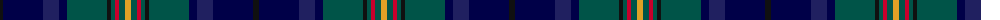

The parent of this is [Schmidt (2014)](/tartans/k/6/db40/dba16/db8/g40/k4/g4/r4/g6/y/6/)

This was sourced from register-of-tartans.  It is a [10 stripes tartan](/stripes/stripes10/).

Original link https://www.tartanregister.gov.uk/tartanDetails.aspx?ref=11046

## Thread count
K/6 DB40 DBa16 DB8 G40 K4 G4 R4 G6 Y/6

## Palette
Each colour and its ΔE from the base-6 reference it is a variant of.

| Colour | Shade | Base | ΔE (OKLab) |
|---|---|---|---|
| DB |  `#000048` | B  | 0.21 |
| DBa |  `#202060` | B  | 0.11 |
| G |  `#005448` | G  | 0.11 |
| K |  `#101010` | K  | 0.17 |
| R |  `#C8002C` | R  | 0.03 |
| Y |  `#E0A126` | Y  | 0.08 |

ID: /variants/k/6/db40/dba16/db8/g40/k4/g4/r4/g6/y/6-db000048-dba202060-g005448-k101010-rc8002c-ye0a126/
