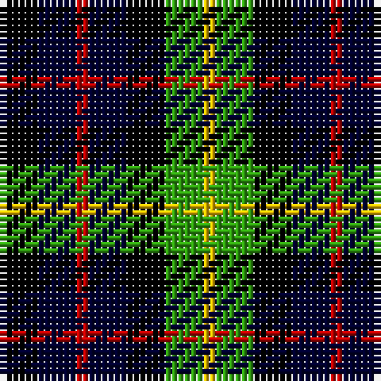

The parent of this is [Montrose of Alabama](/tartans/k/6/db6/r2/db6/k6/g6/y/2/)

This was sourced from weddslist.  It is a [7 stripes tartan](/stripes/stripes7/).

Original link http://www.weddslist.com/cgi-bin/tartans/pg.pl?source=sts

## Thread count
K/6 DB6 R2 DB6 K6 G6 Y/2

## Palette
Each colour and its ΔE from the base-6 reference it is a variant of.

| Colour | Shade | Base | ΔE (OKLab) |
|---|---|---|---|
| DB |  `#000030` | K  | 0.17 |
| G |  `#30A010` | G  | 0.19 |
| K |  `#000000` | K  | 0.00 |
| R |  `#C00000` | R  | 0.02 |
| Y |  `#F0C000` | Y  | 0.01 |

# Sample pattern

ID: /variants/k/6/db6/r2/db6/k6/g6/y/2-db000030-g30a010-k000000-rc00000-yf0c000/
