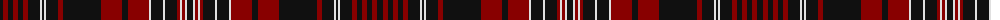

The parent of this is [Amstartan (Personal)](/tartans/k/6/dr5/k5/dr5/k5/dr5/k12/ln2/k2/ln2/k12/dr5/k38/dr21/k6/dr21/ln2/k12/ln2/k12/dr3/ln2/dr3/ln2/k/6/)

This was sourced from tartans-authority.  It is a [25 stripes tartan](/stripes/stripes25/).

Original link http://www.tartansauthority.com/tartan-ferret/display/10126/

## Thread count
K/6 DR5 K5 DR5 K5 DR5 K12 LN2 K2 LN2 K12 DR5 K38 DR21 K6 DR21 LN2 K12 LN2 K12 DR3 LN2 DR3 LN2 K/6

## Palette
Each colour and its ΔE from the base-6 reference it is a variant of.

| Colour | Shade | Base | ΔE (OKLab) |
|---|---|---|---|
| DR |  `#880000` | R  | 0.14 |
| K |  `#101010` | K  | 0.17 |
| LN |  `#E0E0E0` | W  | 0.06 |

ID: /variants/k/6/dr5/k5/dr5/k5/dr5/k12/ln2/k2/ln2/k12/dr5/k38/dr21/k6/dr21/ln2/k12/ln2/k12/dr3/ln2/dr3/ln2/k/6-dr880000-k101010-lne0e0e0/
