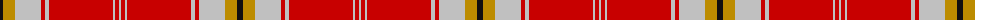

The parent of this is [Fueglistal](/tartans/k/6/dy12/n26/r4/n4/r64/n2/r4/n/2/)

This was sourced from tartans-authority.  It is a [9 stripes tartan](/stripes/stripes9/).

Original link http://www.tartansauthority.com/tartan-ferret/display/10835/

## Thread count
K/6 DY12 N26 R4 N4 R64 N2 R4 N/2

## Palette
Each colour and its ΔE from the base-6 reference it is a variant of.

| Colour | Shade | Base | ΔE (OKLab) |
|---|---|---|---|
| DY |  `#BC8C00` | Y  | 0.16 |
| K |  `#101010` | K  | 0.17 |
| N |  `#C0C0C0` | W  | 0.16 |
| R |  `#C80000` | R  | 0.00 |

ID: /variants/k/6/dy12/n26/r4/n4/r64/n2/r4/n/2-dybc8c00-k101010-nc0c0c0-rc80000/
