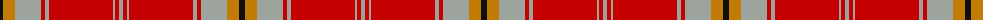

The parent of this is [Fueglistal (Aargau) (Personal)](/tartans/k/6/dy12/n26/r4/n4/r64/n2/r4/n/4/)

This was sourced from register-of-tartans.  It is a [9 stripes tartan](/stripes/stripes9/).

Original link https://www.tartanregister.gov.uk/tartanDetails.aspx?ref=10835

## Thread count
K/6 DY12 N26 R4 N4 R64 N2 R4 N/4

## Palette
Each colour and its ΔE from the base-6 reference it is a variant of.

| Colour | Shade | Base | ΔE (OKLab) |
|---|---|---|---|
| DY |  `#C27C05` | Y  | 0.19 |
| K |  `#101010` | K  | 0.17 |
| N |  `#9DA39D` | Y  | 0.20 |
| R |  `#C50000` | R  | 0.01 |

ID: /variants/k/6/dy12/n26/r4/n4/r64/n2/r4/n/4-dyc27c05-k101010-n9da39d-rc50000/
