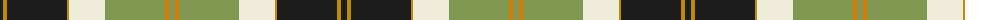

The parent of this is [Bannockbane Green](/tartans/k/6/dy4/k60/dy2/ly36/lg60/o4/lg/6/)

This was sourced from register-of-tartans.  It is a [8 stripes tartan](/stripes/stripes8/).

Original link https://www.tartanregister.gov.uk/tartanDetails.aspx?ref=4873

## Thread count
K/6 DY4 K60 DY2 LY36 LG60 O4 LG/6

## Palette
Each colour and its ΔE from the base-6 reference it is a variant of.

| Colour | Shade | Base | ΔE (OKLab) |
|---|---|---|---|
| DY |  `#BC8C00` | Y  | 0.16 |
| K |  `#1C1C1C` | B  | 0.20 |
| LG |  `#809850` | Y  | 0.20 |
| LY |  `#ECECD8` | W  | 0.04 |
| O |  `#D87C00` | Y  | 0.17 |
| R |  `#980044` | R  | 0.12 |

# Sample pattern

ID: /variants/k/6/dy4/k60/dy2/ly36/lg60/o4/lg/6-dybc8c00-k1c1c1c-lg809850-lyececd8-od87c00-r980044/
