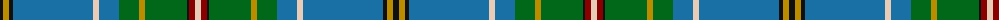

The parent of this is [State Seal of Maryland (Fashion)](/tartans/k/6/dy6/k4/b80/lr6/b20/g20/dy6/g42/k2/dr6/lr/6/)

This was sourced from tartans-authority.  It is a [12 stripes tartan](/stripes/stripes12/).

Original link http://www.tartansauthority.com/tartan-ferret/display/8634/

## Thread count
K/6 DY6 K4 B80 LR6 B20 G20 DY6 G42 K2 DR6 LR/6

## Palette
Each colour and its ΔE from the base-6 reference it is a variant of.

| Colour | Shade | Base | ΔE (OKLab) |
|---|---|---|---|
| B |  `#1870A4` | B  | 0.14 |
| DR |  `#880000` | R  | 0.14 |
| DY |  `#BC8C00` | Y  | 0.16 |
| G |  `#006818` | G  | 0.02 |
| K |  `#101010` | K  | 0.17 |
| LR |  `#E8CCB8` | W  | 0.11 |

ID: /variants/k/6/dy6/k4/b80/lr6/b20/g20/dy6/g42/k2/dr6/lr/6-b1870a4-dr880000-dybc8c00-g006818-k101010-lre8ccb8/
