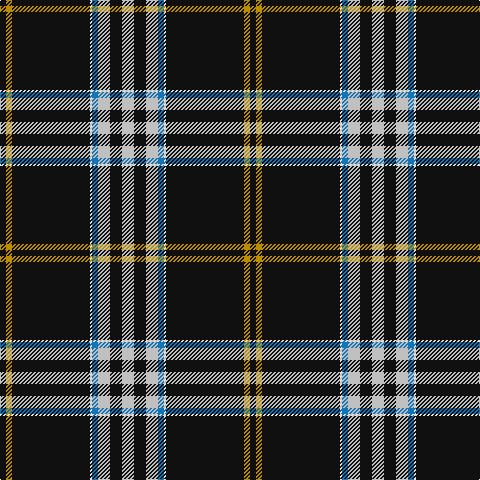

The parent of this is [Washington County Sheriff's Office](/tartans/k/6/dy6/k78/ln2/b6/n12/k12/n/12/)

This was sourced from tartans-authority.  It is a [8 stripes tartan](/stripes/stripes8/).

Original link http://www.tartansauthority.com/tartan-ferret/display/10361/

## Thread count
K/6 DY6 K78 LN2 B6 N12 K12 N/12

## Palette
Each colour and its ΔE from the base-6 reference it is a variant of.

| Colour | Shade | Base | ΔE (OKLab) |
|---|---|---|---|
| B |  `#1474B4` | B  | 0.15 |
| DY |  `#BC8C00` | Y  | 0.16 |
| K |  `#101010` | K  | 0.17 |
| LN |  `#E0E0E0` | W  | 0.06 |
| N |  `#C0C0C0` | W  | 0.16 |

# Sample pattern

ID: /variants/k/6/dy6/k78/ln2/b6/n12/k12/n/12-b1474b4-dybc8c00-k101010-lne0e0e0-nc0c0c0/
