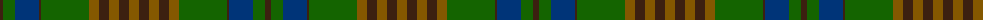

The parent of this is [RSABI (Corporate)](/tartans/k/6/g12/db24/k2/g48/t10/k10/t10/k10/t/10/)

This was sourced from tartans-authority.  It is a [10 stripes tartan](/stripes/stripes10/).

Original link http://www.tartansauthority.com/tartan-ferret/display/5393/

## Thread count
K/6 G12 DB24 K2 G48 T10 K10 T10 K10 T/10

## Palette
Each colour and its ΔE from the base-6 reference it is a variant of.

| Colour | Shade | Base | ΔE (OKLab) |
|---|---|---|---|
| DB |  `#003478` | B  | 0.06 |
| G |  `#146400` | G  | 0.01 |
| K |  `#3C2010` | B  | 0.20 |
| T |  `#845800` | G  | 0.16 |

ID: /variants/k/6/g12/db24/k2/g48/t10/k10/t10/k10/t/10-db003478-g146400-k3c2010-t845800/
