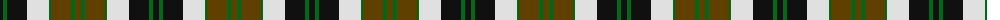
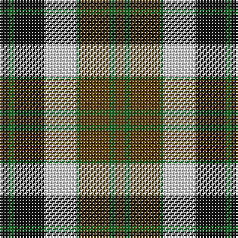

The parent of this is [Dalveen (1981)](/tartans/k/6/g4/k20/ln22/g2/t20/g4/t/6/)

This was sourced from register-of-tartans.  It is a [8 stripes tartan](/stripes/stripes8/).

Original link https://www.tartanregister.gov.uk/tartanDetails.aspx?ref=882

## Thread count
K/6 G4 K20 LN22 G2 T20 G4 T/6

## Palette
Each colour and its ΔE from the base-6 reference it is a variant of.

| Colour | Shade | Base | ΔE (OKLab) |
|---|---|---|---|
| G |  `#006818` | G  | 0.02 |
| K |  `#101010` | K  | 0.17 |
| LN |  `#E0E0E0` | W  | 0.06 |
| T |  `#604000` | G  | 0.14 |
| W |  `#F8F8F8` | W  | 0.01 |

# Sample pattern

ID: /variants/k/6/g4/k20/ln22/g2/t20/g4/t/6-g006818-k101010-lne0e0e0-t604000-wf8f8f8/
