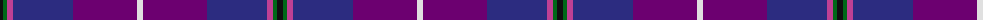

The parent of this is [Pride of Glencoe (Fashion)](/tartans/k/6/g4/p6/db60/pa64/ln/6/)

This was sourced from tartans-authority.  It is a [6 stripes tartan](/stripes/stripes6/).

Original link http://www.tartansauthority.com/tartan-ferret/display/3446/

## Thread count
K/6 G4 P6 DB60 Pa64 LN/6

## Palette
Each colour and its ΔE from the base-6 reference it is a variant of.

| Colour | Shade | Base | ΔE (OKLab) |
|---|---|---|---|
| DB |  `#2C2C80` | B  | 0.05 |
| G |  `#006818` | G  | 0.02 |
| K |  `#101010` | K  | 0.17 |
| LN |  `#E0E0E0` | W  | 0.06 |
| P |  `#C04094` | R  | 0.17 |
| Pa |  `#6C0070` | B  | 0.15 |

# Sample pattern

ID: /variants/k/6/g4/p6/db60/pa64/ln/6-db2c2c80-g006818-k101010-lne0e0e0-pc04094-pa6c0070/
