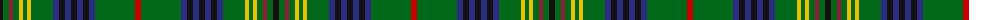

The parent of this is [Myron Family Tartan Tartan Number: 1105. Earliest known date: pre 2003 Designed for the town celebrations of 1958-59 by G. Lawson of the Musselburgh Co-operative Society. See products available Copyright © Blair Urquhart, Comrie, 2015](/tartans/k/6/g6/dr4/g6/y4/g4/y4/g22/db6/k6/db6/k6/db6/k6/db6/g40/r/6/)

This was sourced from house-of-tartan.  It is a [17 stripes tartan](/stripes/stripes17/).

Original link http://www.house-of-tartan.scotland.net/house/TartanViewjs.asp?colr=Def&tnam=1105

## Thread count
K/6 G6 DR4 G6 Y4 G4 Y4 G22 DB6 K6 DB6 K6 DB6 K6 DB6 G40 R/6

## Palette
Each colour and its ΔE from the base-6 reference it is a variant of.

| Colour | Shade | Base | ΔE (OKLab) |
|---|---|---|---|
| DB |  `#2C2C80` | B  | 0.05 |
| DR |  `#901C38` | R  | 0.12 |
| G |  `#006818` | G  | 0.02 |
| K |  `#101010` | K  | 0.17 |
| R |  `#C80000` | R  | 0.00 |
| Y |  `#E8C000` | Y  | 0.00 |

ID: /variants/k/6/g6/dr4/g6/y4/g4/y4/g22/db6/k6/db6/k6/db6/k6/db6/g40/r/6-db2c2c80-dr901c38-g006818-k101010-rc80000-ye8c000/
