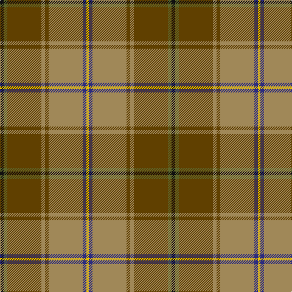

The parent of this is [California Highway Patrol (Corporate](/tartans/k/6/g6/t56/lt6/t6/lt56/db6/y/4/)

This was sourced from tartans-authority.  It is a [8 stripes tartan](/stripes/stripes8/).

Original link http://www.tartansauthority.com/tartan-ferret/display/3786/

## Thread count
K/6 G6 T56 LT6 T6 LT56 DB6 Y/4

## Palette
Each colour and its ΔE from the base-6 reference it is a variant of.

| Colour | Shade | Base | ΔE (OKLab) |
|---|---|---|---|
| DB |  `#2C2C80` | B  | 0.05 |
| G |  `#5C6428` | G  | 0.09 |
| K |  `#101010` | K  | 0.17 |
| LT |  `#A08858` | Y  | 0.21 |
| T |  `#604000` | G  | 0.14 |
| Y |  `#E8C000` | Y  | 0.00 |

# Sample pattern

ID: /variants/k/6/g6/t56/lt6/t6/lt56/db6/y/4-db2c2c80-g5c6428-k101010-lta08858-t604000-ye8c000/
