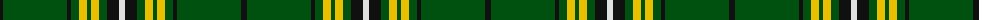

The parent of this is [University of Alberta (Corporate)](/tartans/k/6/g64/k4/g8/y8/g4/y8/g8/k12/ln/6/)

This was sourced from tartans-authority.  It is a [10 stripes tartan](/stripes/stripes10/).

Original link http://www.tartansauthority.com/tartan-ferret/display/7629/

## Thread count
K/6 G64 K4 G8 Y8 G4 Y8 G8 K12 LN/6

## Palette
Each colour and its ΔE from the base-6 reference it is a variant of.

| Colour | Shade | Base | ΔE (OKLab) |
|---|---|---|---|
| G |  `#005010` | G  | 0.07 |
| K |  `#101010` | K  | 0.17 |
| LN |  `#E0E0E0` | W  | 0.06 |
| Y |  `#E8C000` | Y  | 0.00 |

ID: /variants/k/6/g64/k4/g8/y8/g4/y8/g8/k12/ln/6-g005010-k101010-lne0e0e0-ye8c000/
