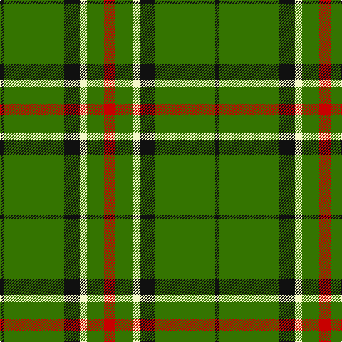

The parent of this is [Sir Billi (Corporate)](/tartans/k/6/g84/k22/ly10/g24/r/16/)

This was sourced from tartans-authority.  It is a [6 stripes tartan](/stripes/stripes6/).

Original link http://www.tartansauthority.com/tartan-ferret/display/6887/

## Thread count
K/6 G84 K22 LY10 G24 R/16

## Palette
Each colour and its ΔE from the base-6 reference it is a variant of.

| Colour | Shade | Base | ΔE (OKLab) |
|---|---|---|---|
| G |  `#347400` | G  | 0.06 |
| K |  `#101010` | K  | 0.17 |
| LY |  `#F4F8C8` | W  | 0.06 |
| R |  `#C80000` | R  | 0.00 |

# Sample pattern

ID: /variants/k/6/g84/k22/ly10/g24/r/16-g347400-k101010-lyf4f8c8-rc80000/
