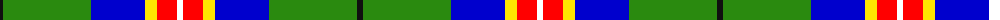

The parent of this is [Official Glasgow 2014, The](/tartans/k/6/g88/b54/y12/r20/w/6/)

This was sourced from register-of-tartans.  It is a [6 stripes tartan](/stripes/stripes6/).

Original link https://www.tartanregister.gov.uk/tartanDetails.aspx?ref=10600

## Thread count
K/6 G88 B54 Y12 R20 W/6

## Palette
Each colour and its ΔE from the base-6 reference it is a variant of.

| Colour | Shade | Base | ΔE (OKLab) |
|---|---|---|---|
| B |  `#0000CD` | B  | 0.15 |
| G |  `#2A8A0F` | G  | 0.12 |
| K |  `#101010` | K  | 0.17 |
| R |  `#FF0000` | R  | 0.11 |
| W |  `#FFFFFF` | W  | 0.03 |
| Y |  `#FFE600` | Y  | 0.10 |

# Sample pattern

ID: /variants/k/6/g88/b54/y12/r20/w/6-b0000cd-g2a8a0f-k101010-rff0000-wffffff-yffe600/
