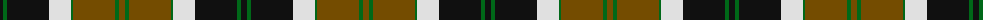
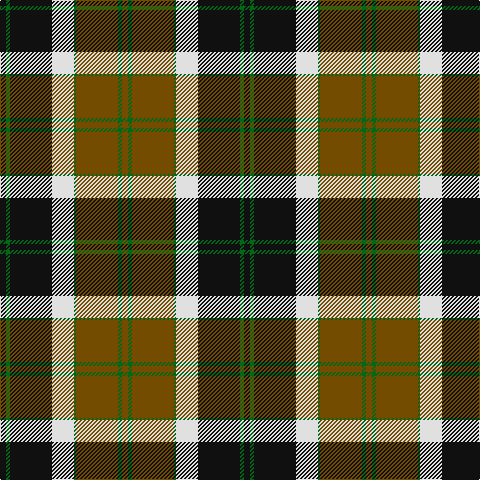

The parent of this is [Dalveen (Fashion)](/tartans/k/6/ga4/k42/ln22/ga2/t42/g4/t/6/)

This was sourced from tartans-authority.  It is a [8 stripes tartan](/stripes/stripes8/).

Original link http://www.tartansauthority.com/tartan-ferret/display/6126/

## Thread count
K/6 Ga4 K42 LN22 Ga2 T42 G4 T/6

## Palette
Each colour and its ΔE from the base-6 reference it is a variant of.

| Colour | Shade | Base | ΔE (OKLab) |
|---|---|---|---|
| G |  `#006818` | G  | 0.02 |
| Ga |  `#006818` | G  | 0.02 |
| K |  `#101010` | K  | 0.17 |
| LN |  `#E0E0E0` | W  | 0.06 |
| T |  `#744C00` | G  | 0.14 |

# Sample pattern

ID: /variants/k/6/ga4/k42/ln22/ga2/t42/g4/t/6-g006818-ga006818-k101010-lne0e0e0-t744c00/
