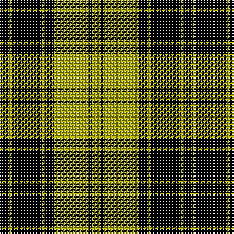

The parent of this is [MacLachlan VS](/tartans/k/6/lg2/k21/lg2/k6/lg24/k2/lg/6/)

This was sourced from weddslist.  It is a [8 stripes tartan](/stripes/stripes8/).

Original link http://www.weddslist.com/cgi-bin/tartans/pg.pl?source=x

## Thread count
K/6 LG2 K21 LG2 K6 LG24 K2 LG/6

## Palette
Each colour and its ΔE from the base-6 reference it is a variant of.

| Colour | Shade | Base | ΔE (OKLab) |
|---|---|---|---|
| K |  `#000000` | K  | 0.00 |
| LG |  `#AAAA00` | Y  | 0.11 |

# Sample pattern

ID: /variants/k/6/lg2/k21/lg2/k6/lg24/k2/lg/6-k000000-lgaaaa00/
