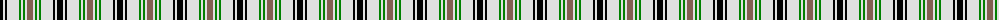

The parent of this is [Puffin](/tartans/k/6/ln2/k2/ln12/g2/ln2/g2/ln2/lt/6/)

This was sourced from weddslist.  It is a [9 stripes tartan](/stripes/stripes9/).

Original link http://www.weddslist.com/cgi-bin/tartans/pg.pl?source=sts

## Thread count
K/6 LN2 K2 LN12 G2 LN2 G2 LN2 LT/6

## Palette
Each colour and its ΔE from the base-6 reference it is a variant of.

| Colour | Shade | Base | ΔE (OKLab) |
|---|---|---|---|
| G |  `#008000` | G  | 0.09 |
| K |  `#000000` | K  | 0.00 |
| LN |  `#E0E0E0` | W  | 0.06 |
| LT |  `#806050` | R  | 0.17 |

ID: /variants/k/6/ln2/k2/ln12/g2/ln2/g2/ln2/lt/6-g008000-k000000-lne0e0e0-lt806050/
