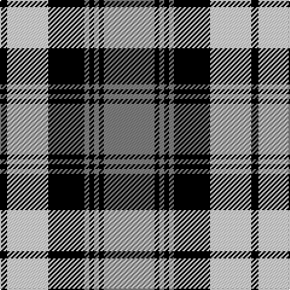

The parent of this is [Laksaa](/tartans/k/6/ln34/k30/n4/k4/n4/k4/n/42/)

This was sourced from weddslist.  It is a [8 stripes tartan](/stripes/stripes8/).

Original link http://www.weddslist.com/cgi-bin/tartans/pg.pl?source=sts

## Thread count
K/6 LN34 K30 N4 K4 N4 K4 N/42

## Palette
Each colour and its ΔE from the base-6 reference it is a variant of.

| Colour | Shade | Base | ΔE (OKLab) |
|---|---|---|---|
| K |  `#000000` | K  | 0.00 |
| LN |  `#E0E0E0` | W  | 0.06 |
| N |  `#808080` | G  | 0.22 |

# Sample pattern

ID: /variants/k/6/ln34/k30/n4/k4/n4/k4/n/42-k000000-lne0e0e0-n808080/
