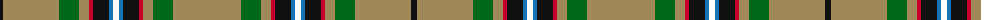

The parent of this is [Lambert Hunting (Personal)](/tartans/k/6/lt56/g20/lt10/r4/k16/b4/w6/b4/k16/r4/lt10/g20/lt/68/)

This was sourced from tartans-authority.  It is a [14 stripes tartan](/stripes/stripes14/).

Original link http://www.tartansauthority.com/tartan-ferret/display/10663/

## Thread count
K/6 LT56 G20 LT10 R4 K16 B4 W6 B4 K16 R4 LT10 G20 LT/68

## Palette
Each colour and its ΔE from the base-6 reference it is a variant of.

| Colour | Shade | Base | ΔE (OKLab) |
|---|---|---|---|
| B |  `#1474B4` | B  | 0.15 |
| G |  `#006818` | G  | 0.02 |
| K |  `#101010` | K  | 0.17 |
| LT |  `#A08858` | Y  | 0.21 |
| R |  `#C8002C` | R  | 0.03 |
| W |  `#FCFCFC` | W  | 0.03 |

ID: /variants/k/6/lt56/g20/lt10/r4/k16/b4/w6/b4/k16/r4/lt10/g20/lt/68-b1474b4-g006818-k101010-lta08858-rc8002c-wfcfcfc/
