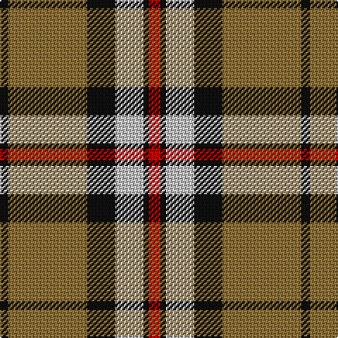

The parent of this is [Thomson Camel (Jedburgh Mill)](/tartans/k/6/lt56/k20/n20/k4/r/8/)

This was sourced from register-of-tartans.  It is a [6 stripes tartan](/stripes/stripes6/).

Original link https://www.tartanregister.gov.uk/tartanDetails.aspx?ref=4122

## Thread count
K/6 LT56 K20 N20 K4 R/8

## Palette
Each colour and its ΔE from the base-6 reference it is a variant of.

| Colour | Shade | Base | ΔE (OKLab) |
|---|---|---|---|
| K |  `#101010` | K  | 0.17 |
| LT |  `#8C7038` | G  | 0.18 |
| N |  `#C0C0C0` | W  | 0.16 |
| R |  `#C80000` | R  | 0.00 |

# Sample pattern

ID: /variants/k/6/lt56/k20/n20/k4/r/8-k101010-lt8c7038-nc0c0c0-rc80000/
