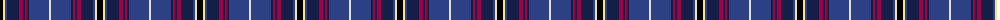

The parent of this is [Ertico](/tartans/k/6/ly2/b2/db12/r4/db2/r2/db2/b20/ln/2/)

This was sourced from register-of-tartans.  It is a [10 stripes tartan](/stripes/stripes10/).

Original link https://www.tartanregister.gov.uk/tartanDetails.aspx?ref=11494

## Thread count
K/6 LY2 B2 DB12 R4 DB2 R2 DB2 B20 LN/2

## Palette
Each colour and its ΔE from the base-6 reference it is a variant of.

| Colour | Shade | Base | ΔE (OKLab) |
|---|---|---|---|
| B |  `#2C4084` | B  | 0.00 |
| DB |  `#141E46` | B  | 0.15 |
| K |  `#000000` | K  | 0.00 |
| LN |  `#E0E0E0` | W  | 0.06 |
| LY |  `#F8E38C` | Y  | 0.11 |
| R |  `#A00048` | R  | 0.11 |

ID: /variants/k/6/ly2/b2/db12/r4/db2/r2/db2/b20/ln/2-b2c4084-db141e46-k000000-lne0e0e0-lyf8e38c-ra00048/
