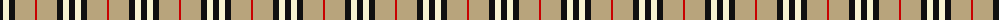
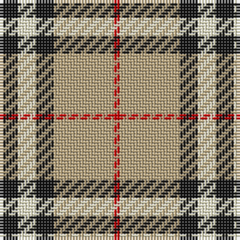

The parent of this is [Burberry (Original) (Corporate)](/tartans/k/6/ly6/k6/lg20/r/2/)

This was sourced from tartans-authority.  It is a [5 stripes tartan](/stripes/stripes5/).

Original link http://www.tartansauthority.com/tartan-ferret/display/1239/

## Thread count
K/6 LY6 K6 LG20 R/2

## Palette
Each colour and its ΔE from the base-6 reference it is a variant of.

| Colour | Shade | Base | ΔE (OKLab) |
|---|---|---|---|
| K |  `#101010` | K  | 0.17 |
| LG |  `#B8A47C` | Y  | 0.14 |
| LY |  `#F8F4D0` | W  | 0.04 |
| R |  `#C80000` | R  | 0.00 |

# Sample pattern

ID: /variants/k/6/ly6/k6/lg20/r/2-k101010-lgb8a47c-lyf8f4d0-rc80000/
