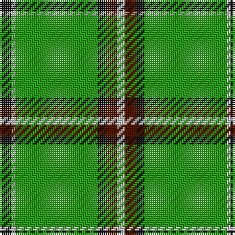

The parent of this is [Leach Hunting](/tartans/k/6/n2/g30/g12/k4/dr6/n/4/)

This was sourced from register-of-tartans.  It is a [7 stripes tartan](/stripes/stripes7/).

Original link https://www.tartanregister.gov.uk/tartanDetails.aspx?ref=2075

## Thread count
K/6 N2 G30 G12 K4 DR6 N/4

## Palette
Each colour and its ΔE from the base-6 reference it is a variant of.

| Colour | Shade | Base | ΔE (OKLab) |
|---|---|---|---|
| DR |  `#501400` | B  | 0.22 |
| G |  `#289C18` | G  | 0.18 |
| K |  `#101010` | K  | 0.17 |
| N |  `#C0C0C0` | W  | 0.16 |

# Sample pattern

ID: /variants/k/6/n2/g30/g12/k4/dr6/n/4-dr501400-g289c18-k101010-nc0c0c0/
