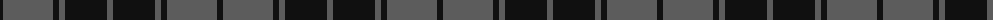

The parent of this is [Slanj, Grey (Corporate)](/tartans/k/6/n50/k6/n6/k42/n/6/)

This was sourced from tartans-authority.  It is a [6 stripes tartan](/stripes/stripes6/).

Original link http://www.tartansauthority.com/tartan-ferret/display/7840/

## Thread count
K/6 N50 K6 N6 K42 N/6

## Palette
Each colour and its ΔE from the base-6 reference it is a variant of.

| Colour | Shade | Base | ΔE (OKLab) |
|---|---|---|---|
| K |  `#101010` | K  | 0.17 |
| N |  `#5C5C5C` | B  | 0.14 |

# Sample pattern

ID: /variants/k/6/n50/k6/n6/k42/n/6-k101010-n5c5c5c/
