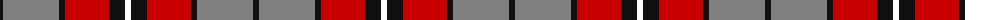

The parent of this is [Henkel (Corporate)](/tartans/k/6/n56/k6/r44/k16/w/6/)

This was sourced from tartans-authority.  It is a [6 stripes tartan](/stripes/stripes6/).

Original link http://www.tartansauthority.com/tartan-ferret/display/6161/

## Thread count
K/6 N56 K6 R44 K16 W/6

## Palette
Each colour and its ΔE from the base-6 reference it is a variant of.

| Colour | Shade | Base | ΔE (OKLab) |
|---|---|---|---|
| K |  `#101010` | K  | 0.17 |
| N |  `#808080` | G  | 0.22 |
| R |  `#C80000` | R  | 0.00 |
| W |  `#FCFCFC` | W  | 0.03 |

# Sample pattern

ID: /variants/k/6/n56/k6/r44/k16/w/6-k101010-n808080-rc80000-wfcfcfc/
