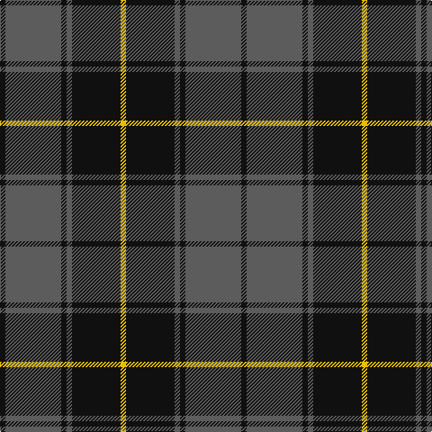

The parent of this is [Scottish National Party (Corporate)](/tartans/k/6/n62/k6/n6/k54/y/6/)

This was sourced from tartans-authority.  It is a [6 stripes tartan](/stripes/stripes6/).

Original link http://www.tartansauthority.com/tartan-ferret/display/7839/

## Thread count
K/6 N62 K6 N6 K54 Y/6

## Palette
Each colour and its ΔE from the base-6 reference it is a variant of.

| Colour | Shade | Base | ΔE (OKLab) |
|---|---|---|---|
| K |  `#101010` | K  | 0.17 |
| N |  `#5C5C5C` | B  | 0.14 |
| Y |  `#E8C000` | Y  | 0.00 |

# Sample pattern

ID: /variants/k/6/n62/k6/n6/k54/y/6-k101010-n5c5c5c-ye8c000/
