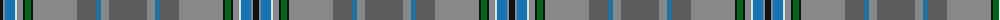

The parent of this is [Giants Causeway (District)](/tartans/k/6/na2/b10/ln2/na6/k2/g6/k2/na44/n20/b4/na8/n/38/)

This was sourced from tartans-authority.  It is a [13 stripes tartan](/stripes/stripes13/).

Original link http://www.tartansauthority.com/tartan-ferret/display/10430/

## Thread count
K/6 Na2 B10 LN2 Na6 K2 G6 K2 Na44 N20 B4 Na8 N/38

## Palette
Each colour and its ΔE from the base-6 reference it is a variant of.

| Colour | Shade | Base | ΔE (OKLab) |
|---|---|---|---|
| B |  `#1474B4` | B  | 0.15 |
| G |  `#006818` | G  | 0.02 |
| K |  `#101010` | K  | 0.17 |
| LN |  `#E0E0E0` | W  | 0.06 |
| N |  `#5C5C5C` | B  | 0.14 |
| Na |  `#888888` | R  | 0.24 |

ID: /variants/k/6/na2/b10/ln2/na6/k2/g6/k2/na44/n20/b4/na8/n/38-b1474b4-g006818-k101010-lne0e0e0-n5c5c5c-na888888/
