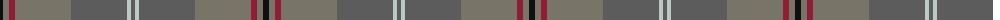

The parent of this is [Isle of Cumbrae (Corporate)](/tartans/k/6/nb6/dr6/nb56/n56/na4/n/4/)

This was sourced from tartans-authority.  It is a [7 stripes tartan](/stripes/stripes7/).

Original link http://www.tartansauthority.com/tartan-ferret/display/7170/

## Thread count
K/6 Nb6 DR6 Nb56 N56 Na4 N/4

## Palette
Each colour and its ΔE from the base-6 reference it is a variant of.

| Colour | Shade | Base | ΔE (OKLab) |
|---|---|---|---|
| DR |  `#901C38` | R  | 0.12 |
| K |  `#101010` | K  | 0.17 |
| N |  `#5C5C5C` | B  | 0.14 |
| Na |  `#BCC8C4` | W  | 0.14 |
| Nb |  `#787468` | G  | 0.18 |

# Sample pattern

ID: /variants/k/6/nb6/dr6/nb56/n56/na4/n/4-dr901c38-k101010-n5c5c5c-nabcc8c4-nb787468/
