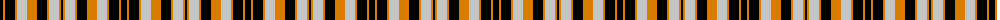

The parent of this is [Dundee United Football Club (Corpor)](/tartans/k/6/o2/k10/o2/n10/o10/k10/o2/n10/o2/k/2/)

This was sourced from tartans-authority.  It is a [11 stripes tartan](/stripes/stripes11/).

Original link http://www.tartansauthority.com/tartan-ferret/display/4757/

## Thread count
K/6 O2 K10 O2 N10 O10 K10 O2 N10 O2 K/2

## Palette
Each colour and its ΔE from the base-6 reference it is a variant of.

| Colour | Shade | Base | ΔE (OKLab) |
|---|---|---|---|
| K |  `#000000` | K  | 0.00 |
| N |  `#C4C4C4` | W  | 0.15 |
| O |  `#D87C00` | Y  | 0.17 |

ID: /variants/k/6/o2/k10/o2/n10/o10/k10/o2/n10/o2/k/2-k000000-nc4c4c4-od87c00/
