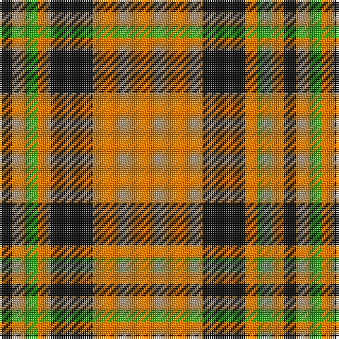

The parent of this is [Volkswagen Orange Fashion Tartan Tartan Number: 7504. Earliest known date: pre 2008 Small sample of Volkswagen upholstery fabric taken in to The Scottish Shoppe in Calgary, Alberta. Sample didn't show the complete sett but the proportions of what has been reconstructed here are correct. The threadcount has been multiplied by three and the actual sett in the vehicle was probably about 12 inches. The colours would be changed depending upon the body colour of the vehicle. Enquiries are being made with VW (Feb 2008) to try and pin down the patterns. See products available Copyright © Blair Urquhart, Comrie, 2015](/tartans/k/6/o6/g6/o6/k20/o/52/)

This was sourced from house-of-tartan.  It is a [6 stripes tartan](/stripes/stripes6/).

Original link http://www.house-of-tartan.scotland.net/house/TartanViewjs.asp?colr=Def&tnam=7504

## Thread count
K/6 O6 G6 O6 K20 O/52

## Palette
Each colour and its ΔE from the base-6 reference it is a variant of.

| Colour | Shade | Base | ΔE (OKLab) |
|---|---|---|---|
| G |  `#289C18` | G  | 0.18 |
| K |  `#101010` | K  | 0.17 |
| O |  `#D87C00` | Y  | 0.17 |

# Sample pattern

ID: /variants/k/6/o6/g6/o6/k20/o/52-g289c18-k101010-od87c00/
