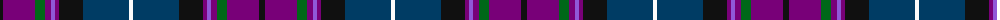

The parent of this is [Creiff Highland Gathering](/tartans/k/6/pa32/g10/pa6/p4/pa4/k24/db46/w/4/)

This was sourced from tartans-authority.  It is a [9 stripes tartan](/stripes/stripes9/).

Original link http://www.tartansauthority.com/tartan-ferret/display/11108/

## Thread count
K/6 Pa32 G10 Pa6 P4 Pa4 K24 DB46 W/4

## Palette
Each colour and its ΔE from the base-6 reference it is a variant of.

| Colour | Shade | Base | ΔE (OKLab) |
|---|---|---|---|
| DB |  `#003C64` | B  | 0.07 |
| G |  `#006818` | G  | 0.02 |
| K |  `#101010` | K  | 0.17 |
| P |  `#9058D8` | B  | 0.22 |
| Pa |  `#780078` | B  | 0.16 |
| W |  `#FCFCFC` | W  | 0.03 |

ID: /variants/k/6/pa32/g10/pa6/p4/pa4/k24/db46/w/4-db003c64-g006818-k101010-p9058d8-pa780078-wfcfcfc/
