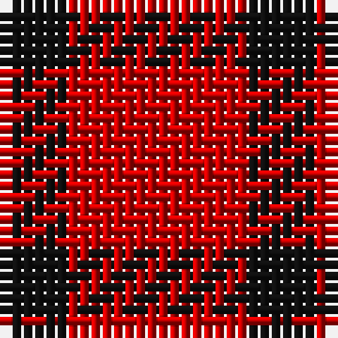

The parent of this is [Wilson's No.234](/tartans/k/6/r/16/)

This was sourced from register-of-tartans.  It is a [2 stripes tartan](/stripes/stripes2/).

Original link https://www.tartanregister.gov.uk/tartanDetails.aspx?ref=4761

## Thread count
K/6 R/16

## Palette
K R

# Sample pattern

ID: /variants/k/6/r/16-k101010-rc80000/
