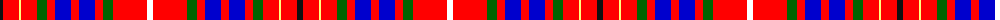

The parent of this is [Bruce, William](/tartans/k/6/r16/ly2/r16/g10/r8/b16/r8/b16/r8/g10/r34/w/6/)

This was sourced from register-of-tartans.  It is a [13 stripes tartan](/stripes/stripes13/).

Original link https://www.tartanregister.gov.uk/tartanDetails.aspx?ref=10212

## Thread count
K/6 R16 LY2 R16 G10 R8 B16 R8 B16 R8 G10 R34 W/6

## Palette
Each colour and its ΔE from the base-6 reference it is a variant of.

| Colour | Shade | Base | ΔE (OKLab) |
|---|---|---|---|
| B |  `#0000CD` | B  | 0.15 |
| G |  `#006400` | G  | 0.00 |
| K |  `#101010` | K  | 0.17 |
| LY |  `#FFFF7E` | W  | 0.15 |
| R |  `#FF0000` | R  | 0.11 |
| W |  `#FFFFFF` | W  | 0.03 |

ID: /variants/k/6/r16/ly2/r16/g10/r8/b16/r8/b16/r8/g10/r34/w/6-b0000cd-g006400-k101010-lyffff7e-rff0000-wffffff/
