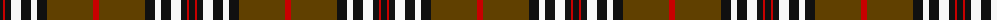

The parent of this is [Southdown (Fashion)](/tartans/k/6/r2/k6/w10/k10/w6/k10/t46/r/6/)

This was sourced from tartans-authority.  It is a [9 stripes tartan](/stripes/stripes9/).

Original link http://www.tartansauthority.com/tartan-ferret/display/1194/

## Thread count
K/6 R2 K6 W10 K10 W6 K10 T46 R/6

## Palette
Each colour and its ΔE from the base-6 reference it is a variant of.

| Colour | Shade | Base | ΔE (OKLab) |
|---|---|---|---|
| K |  `#101010` | K  | 0.17 |
| R |  `#C80000` | R  | 0.00 |
| T |  `#604000` | G  | 0.14 |
| W |  `#F8F8F8` | W  | 0.01 |

ID: /variants/k/6/r2/k6/w10/k10/w6/k10/t46/r/6-k101010-rc80000-t604000-wf8f8f8/
