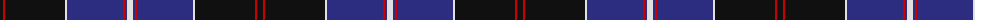

The parent of this is [Dunlop Clan Tartan Tartan Number: 1197. Earliest known date: 1982 Revised version See products available Copyright © Blair Urquhart, Comrie, 2015](/tartans/k/6/r2/k60/ln2/db56/r2/db2/ln/6/)

This was sourced from house-of-tartan.  It is a [8 stripes tartan](/stripes/stripes8/).

Original link http://www.house-of-tartan.scotland.net/house/TartanViewjs.asp?colr=Def&tnam=1197

## Thread count
K/6 R2 K60 LN2 DB56 R2 DB2 LN/6

## Palette
Each colour and its ΔE from the base-6 reference it is a variant of.

| Colour | Shade | Base | ΔE (OKLab) |
|---|---|---|---|
| DB |  `#2C2C80` | B  | 0.05 |
| K |  `#101010` | K  | 0.17 |
| LN |  `#E0E0E0` | W  | 0.06 |
| R |  `#C80000` | R  | 0.00 |

# Sample pattern

ID: /variants/k/6/r2/k60/ln2/db56/r2/db2/ln/6-db2c2c80-k101010-lne0e0e0-rc80000/
