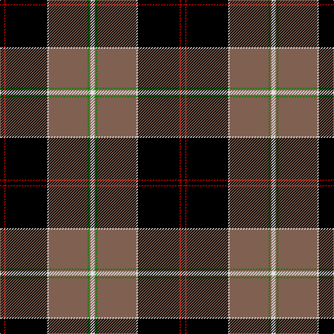

The parent of this is [Dunlop](/tartans/k/6/r2/k60/ln2/lt56/g2/lt2/ln/6/)

This was sourced from weddslist.  It is a [8 stripes tartan](/stripes/stripes8/).

Original link http://www.weddslist.com/cgi-bin/tartans/pg.pl?source=sts

## Thread count
K/6 R2 K60 LN2 LT56 G2 LT2 LN/6

## Palette
Each colour and its ΔE from the base-6 reference it is a variant of.

| Colour | Shade | Base | ΔE (OKLab) |
|---|---|---|---|
| G |  `#008000` | G  | 0.09 |
| K |  `#000000` | K  | 0.00 |
| LN |  `#E0E0E0` | W  | 0.06 |
| LT |  `#806050` | R  | 0.17 |
| R |  `#C00000` | R  | 0.02 |

# Sample pattern

ID: /variants/k/6/r2/k60/ln2/lt56/g2/lt2/ln/6-g008000-k000000-lne0e0e0-lt806050-rc00000/
